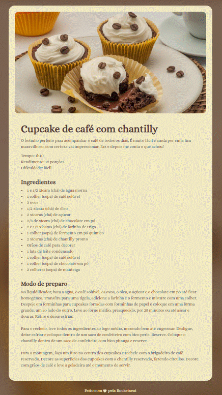

# Projeto Receitas Fullstack

Projeto inicial de estudo em HTML e CSS de uma página única de receita.

## Autores

- [@carolsauhi](https://www.github.com/octokatherine)

## Documentação de cores

| Cor               | Hexadecimal                                                |
| ----------------- | ---------------------------------------------------------------- |
| Cor exemplo       |  #573a37 |
| Cor exemplo       |  #f0e8c2 |
| Cor exemplo       |  #291b1a |

## Demonstração

